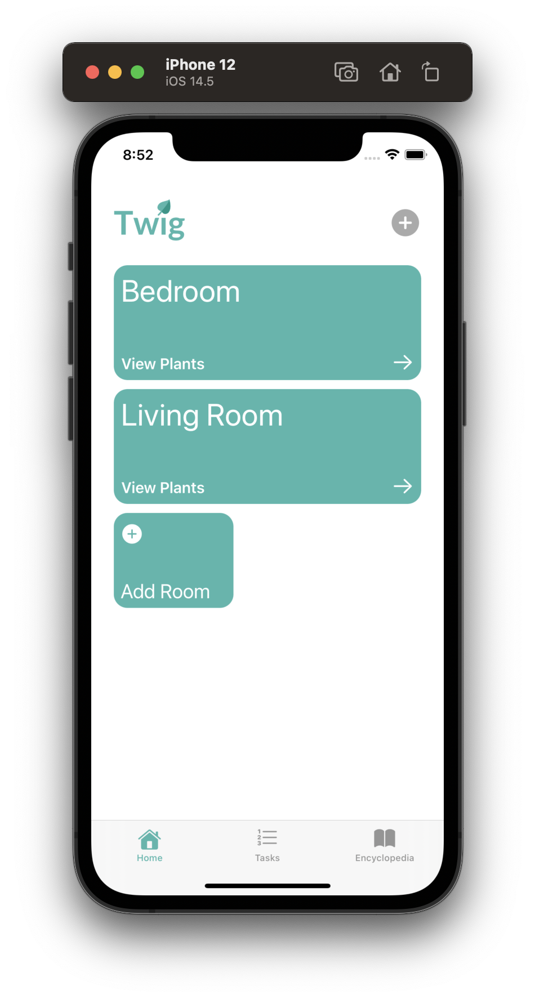
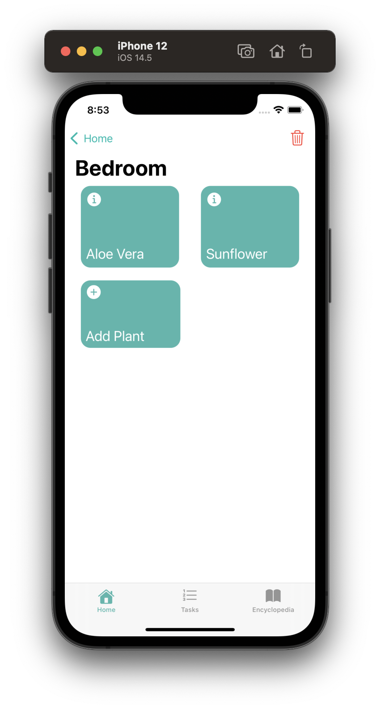
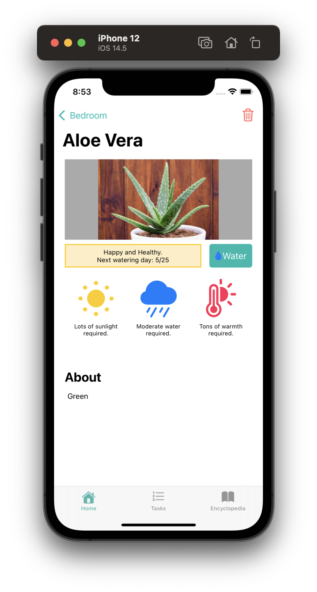

  

<h3 align="center">Twig</h3>

 The houseplant tracker for iOS.
      

---

## About

Twig is a houseplant management suite built using xCode for iOS devices. Using the app, houseplant enthusiasts can intuitively create rooms and organize their plants within them. Twig will keep track of all the necessary details and notify when it's time to water. 

## Getting Started 

These instructions will get you a copy of the project up and running on your local machine for development and testing purposes.

### Prerequisites

Requires a MacOS device with XCode 11 or higher.

### Installing

Clone the project and open with XCode. On first launch, a few default plants will be added for you.

You may need to change the developer signature with your own trusted signature in order to deploy on your device.

## Built Using

- [XCode 11](https://developer.apple.com/xcode/) - iOS IDE
- [Figma](https://www.figma.com/) - Mockups

## Authors

- [Zach Merrill](https://github.com/zachmerrill)
- [Ben Shamas](https://github.com/bsham94)
