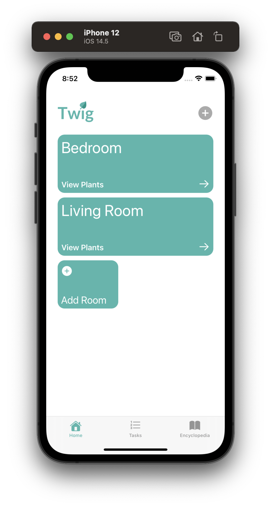
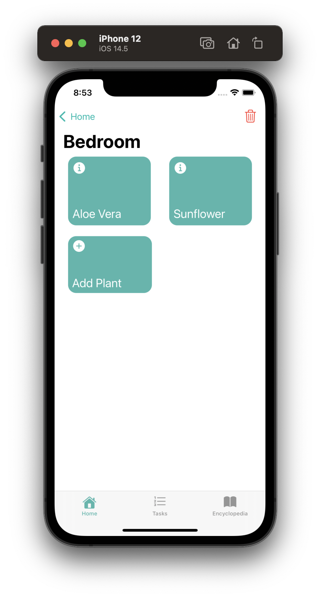
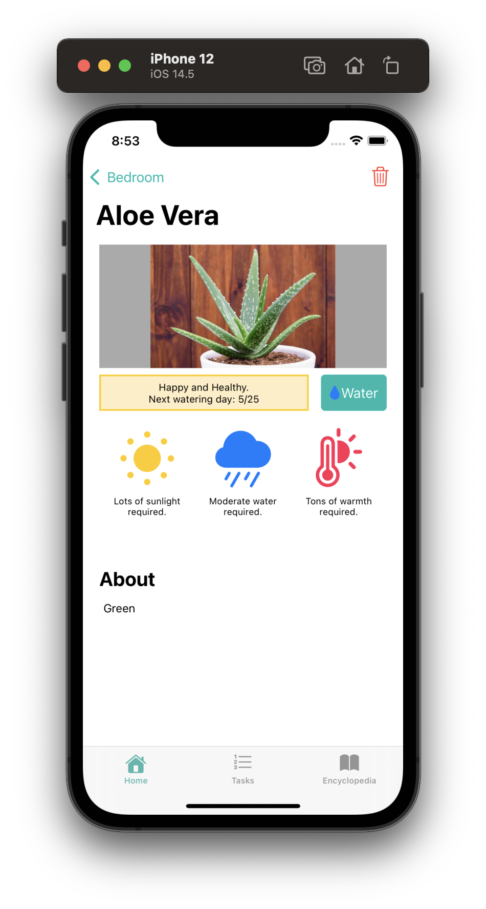

The houseplant tracker for iOS.

##

Twig is a houseplant management suite built using xCode for iOS devices. Using the app, houseplant enthusiasts can intuitively create rooms and organize their plants within them. Twig will keep track of all the necessary details and notify when it's time to water. 

### Tools Used
* Figma - Mockups
* XCode Storyboards & Swift - iOS Application

### Building and Running
* Clone the repository and open using **XCode Version 11** or higher.
